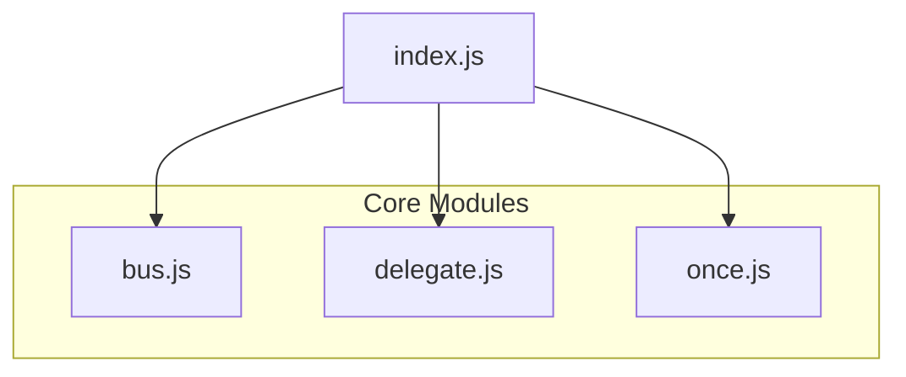

# Native-First Event Architecture Spec & Plan

This document establishes the comprehensive architectural plan, technical specifications, and system guidelines for the Native-First Event Architecture inside `src/core/events/`.

---

## 1. Architectural Philosophy & Principles

The event system in this platform relies on the browser's high-performance native event-dispatch loop rather than recreating arbitrary JavaScript Pub/Sub emitters. We treat standard `EventTarget`, `Event`, and `CustomEvent` APIs as primary scheduling primitives:

1. **Zero Library Bloat:** We leverage native rendering engine loops. Subscribing to, firing, and propagating events has zero impact on bundle size.
2. **Memory Safety by Design:** No event handler should persist past its lifecycle. Every component uses a dedicated, centralized `AbortController` bound to the connection state (`disconnectedCallback`).
3. **Encapsulated & Composed Boundaries:** Communication boundaries respect the Shadow DOM layout, utilizing retargeting, flat tree propagation, and `composedPath` traversal for seamless cross-shadow event routing.
4. **Unidirectional Event Flow:**
   * **Upward Flow:** Custom events bubbled from child to ancestor (`{ bubbles: true, composed: true }`).
   * **Downward Flow:** Direct property/method invocations from parent to child.
   * **Decoupled System Flow:** Global Event Bus singleton (`bus.js`) reserved exclusively for out-of-band cross-cutting system telemetry (e.g., Auth, Connectivity, SW).

---

## 2. Review of Current Architecture

The `src/core/events/` module is divided into four highly focused primitives:



### A. The Global Event Bus (`bus.js`)

* **Purpose:** A decoupled central hub for system-wide notifications that do not map naturally to a DOM lineage.
* **Mechanism:** Leverages an optimized internal `Map<string, Set<{ fn }>>`.
* **Key Feature:** Highly performant execution with snapshotting (`[...set]`) to avoid runtime list mutations during event dispatch.
* **Cleanup:** Integrates `AbortSignal` listeners to automatically execute the `dispose()` callback when component lifecycles cancel.

### B. Event Delegation (`delegate.js`)

* **Purpose:** Attaches a single root listener to dynamically handle events from dynamic descendants, minimizing handler creation and memory consumption.
* **Boundary Traversal:** Traverses through Web Component boundaries by evaluating `event.composedPath()`, checking if descendants match specified queries via `.matches(selector)`.
* **Cleanup:** Disposes of listeners seamlessly on signal abort.

### C. Single Event Awaiter (`once.js`)

* **Purpose:** Wraps standard event listener triggers in a Promise, allowing asynchronous waiting for one-off user or network events.
* **Mechanism:** Passes `{ once: true }` down to the browser's `addEventListener` and handles clean early rejection if the abort signal triggers first.

---

## 3. Composed Event Routing (Shadow DOM Integration)

To traverse the Shadow DOM encapsulation without breaking modular boundaries, our event system implements specific propagation combinations:

| Propagation Mode | Configuration | Boundaries Crossed | Target Behavior | Recommended Use Case |
|---|---|---|---|---|
| **Fully Encapsulated** | `bubbles: false`, `composed: false` | None | Stays on target element | Internal component state ticks |
| **Shadow-Local** | `bubbles: true`, `composed: false` | None (Stops at Shadow Root) | Normal bubbling | Internal compound component parts |
| **Composed Bubbling** | `bubbles: true`, `composed: true` | All boundaries | Retargeted to Shadow Host | Standard child-to-parent callbacks |

```
[Document Root]
      ▲
      │ (Bubbles & Composed)
[Shadow Host (Component)] ◄─── (Retargeted target appears here to Light DOM)
  ┌───┴───┐
  │ Shadow│ (Bubbles inside local tree)
  │ Root  │
  └───┬───┘
      ▲
      │ (Originates)
[Shadow Target Element]
```

### Safe composedPath Traversal

Standard event delegation utilizing `event.target` fails across Shadow DOM limits because of browser-enforced retargeting. `delegate.js` safely bypasses this restriction by reading `event.composedPath()`.

* **Rule:** Always inspect `composedPath()[0]` when you need to resolve the exact physical leaf node that triggered the interaction.

---

## 4. Unidirectional Data Flow & Communication Contract

We enforce highly strict API paths to guarantee components maintain unidirectional, predictable updates:

```mermaid
sequenceDiagram
    participant Parent as Parent Component
    participant Child as Child Component (Shadow DOM)

    rect rgb(20, 20, 30)
        Note over Parent, Child: 1. Downward Communication
        Parent->>Child: Direct Property Assignment (child.items = data)
        Parent->>Child: Imperative Method Call (child.focus())
    end

    rect rgb(30, 20, 20)
        Note over Parent, Child: 2. Upward Communication
        Child-->>Parent: CustomEvent("domain:action", { bubbles, composed })
    end
```



* **No Event Sinks Downward:** Never dispatch an event downward on a child element if setting a direct property or method accomplishes the same task.
* **No Diagonal Bus Calls:** Avoid using the global Event Bus (`bus.js`) to coordinate between nearby siblings. Let their common ancestor mediate their states.

---

## 5. Memory Safety & Garbage Collection (GC) Boundary

Event listeners keep their host components alive in memory because closures bind `this` strongly. The following strategies must be strictly applied:

```
                  ┌─────────────────────────────────┐
                  │          Garbage Collector      │
                  └────────────────┬────────────────┘
                                   │ (Checks for reference paths)
                                   ▼
┌──────────────────┐       ┌──────────────┐       ┌──────────────────┐
│ Component Target │ ◄──── │  AbortSignal │ ◄──── │  Event Listener  │
└──────────────────┘       └──────────────┘       └──────────────────┘
   (Eligible for GC)       (Aborted = Detached)       (Strong Ref broken)
```

1. **Deterministic Teardown:** Ensure *every* single event listener attached outside the element's local DOM (e.g. on `window`, `document`, or `bus`) is attached with `signal: this.#controller.signal`.
2. **WeakMap for Auxiliary Metadata:** When maintaining auxiliary state outside the element class scope, store references in a `WeakMap`. This allows components to be GC'd cleanly when removed from the DOM:

   ```javascript
   const elementStates = new WeakMap();
   ```

3. **Avoid Dynamic Lambda Closures:** Prefer class methods or statically bound private arrow fields. Generating anonymous arrow functions inside rendering paths causes unnecessary garbage allocations:

   ```javascript
   // AVOID:
   this.addEventListener('click', (e) => this.handle(e));

   // PREFER:
   this.addEventListener('click', this.handle, { signal });
   ```

---

## 6. Actionable Implementation & Optimization Enhancements

To make our current system even more robust, we will implement three core enhancements:

### 1. Optimize `delegate.js` (Fast Path Selector Matching)

* **Status:** Current implementation iterates through the entire composed path.
* **Enhancement:** Cache selector match results or stop iteration immediately when traversing past the designated boundaries.

### 2. Standardized Namespace Registry for System Events

* **Status:** Events can be dispatched on the bus using freeform strings.
* **Enhancement:** Maintain a central, typed list of valid events in `plan.md` and export standard constants to prevent typos (e.g., `events.NAMES.AUTH_SIGNED_IN`).

### 3. Progressive Passive Hooks

* **Status:** Native scroll listeners default to passive, but custom handlers do not.
* **Enhancement:** Automatically default touch and wheel event listeners inside components to `{ passive: true }` to enforce Interaction to Next Paint (INP) excellence.

---

## 7. Verification & Telemetry Performance Testing

We verify the event architecture through several layers:

* **Automated Unit Tests:** Assert composition properties, event delegation boundary crossing, and AbortSignal detaching.
* **INP Measurement:** Utilize the `PerformanceObserver` with `type: 'event'` to guarantee that no event handler blocks the main thread for > 50ms.
